---

## about me

- 🔭 building things with **Langchain**, **React**, and whatever seems interesting
- 🤖 into **AI/ML** —Agentic Systems, LLMs, robotics
- 🐳 comfortable with **Docker**, REST APIs, and full-stack web
- 📍 **Pune** · **GlobalLogic-Hitachi**

---

## tech stack

---

## projects

| project | what it does |
|---|---|
| [algojudge](https://github.com/atharva3vedi/algojudge) | leetcode clone · django-rest backend + react frontend |
| [ragbot-ver3v](https://github.com/atharva3vedi/ragbot-ver3v) | RAG chatbot · pinecone + latest LLM stack |
| [2048docker](https://github.com/atharva3vedi/2048docker) | 2048 game deployed on docker |
| [flipkart-robotics](https://github.com/atharva3vedi/flipkart-robotics) | flipkart G.R.I.D. 6 robotics challenge solution |
| [travelbot](https://github.com/atharva3vedi/travelbot) | travel assistant bot |
| [videohelper](https://github.com/atharva3vedi/videohelper) | video utility tool |

---

## github stats

  
  

---

*made with curiosity*
